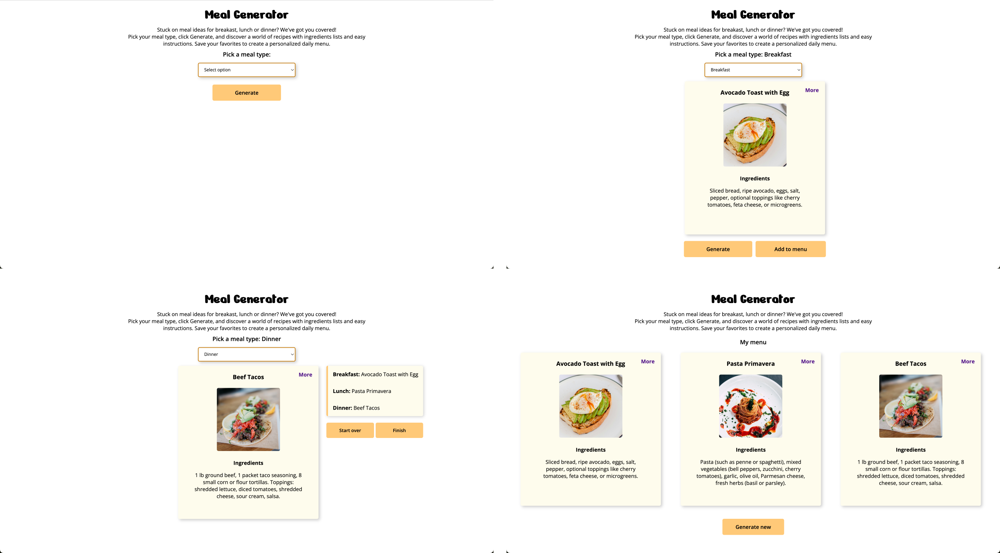

# Meal Generator Project

## Description
Designed and built the Meal Generator project using JavaScript DOM manipulation, jQuery, CSS, and HTML. The development followed an iterative approach driven by user testing, resulting in a well-structured, documented, and error-free app adhering to best practices. The project was showcased as an example for future students.

## Features
-	Meal Ideas: Provides meal suggestions for breakfast, lunch, and dinner.
-	Recipe Generator: Select a meal type and click “Generate” to discover a variety of recipes.
-	Meal Details: Each generated recipe includes the meal name, a picture, a list of ingredients, and cooking instructions.
-	Flip Animation: Meal cards feature a flip animation to reveal recipe details, enhancing user interaction.
-	Favorites: Save favorite recipes to create a personalized daily menu.

## User Flow
1. Select Meal Type: Choose between breakfast, lunch, or dinner.
2. Generate Recipes: Click the “Generate” button to get recipe ideas, complete with meal name, picture, ingredients, and instructions.
3. Flip Animation: Click on a More button on a meal card to see it flip and reveal detailed recipe instructions.
4. Save Favorites: Save preferred recipes to your favorites list for easy access later.

## Frames

